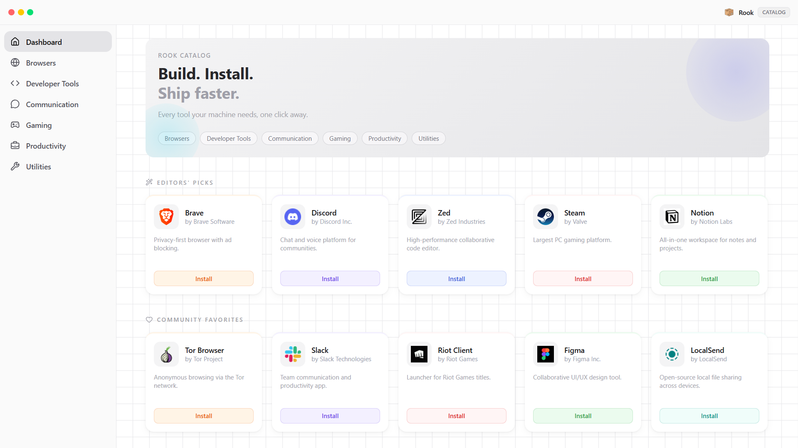

# Rook Catalog

A lightweight desktop software catalog for Windows built around a fast, local-first experience powered by Winget.

---

Rook Catalog is a modern desktop application designed for discovering and installing Windows software through a clean, curated interface. The application focuses on simplicity, responsiveness, and native system integration while maintaining a minimal and distraction-free user experience.

Built with a local-first architecture, Rook Catalog interacts directly with the Windows Package Manager (`winget`) to provide streamlined software installation without relying on cloud services or external launchers.

The interface emphasizes curated discovery through categorized browsing, editor selections, and community-driven recommendations while keeping performance lightweight and native-feeling.

  

